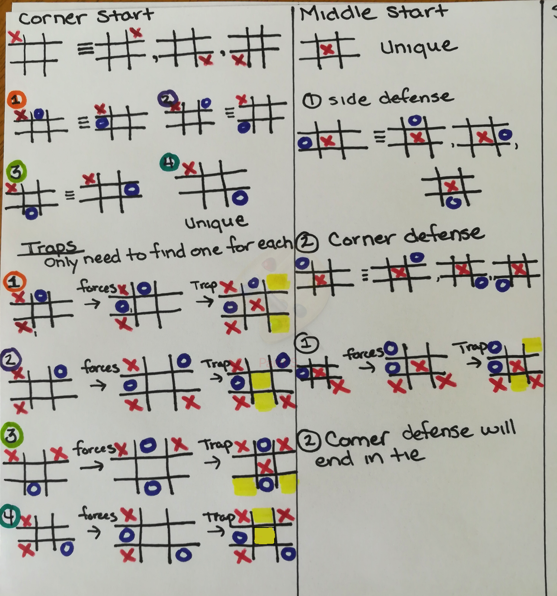
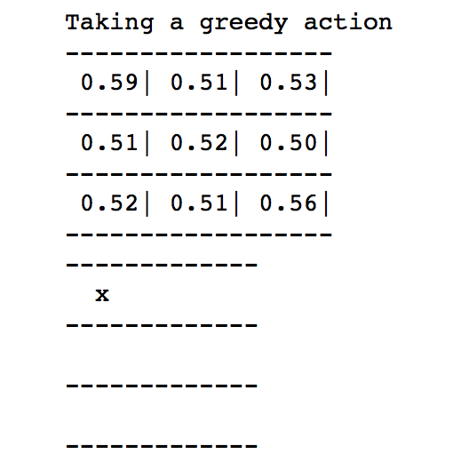
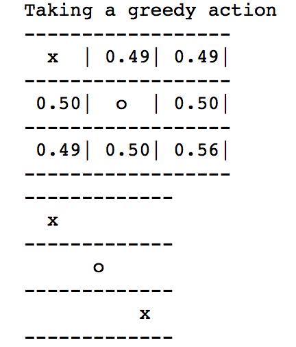
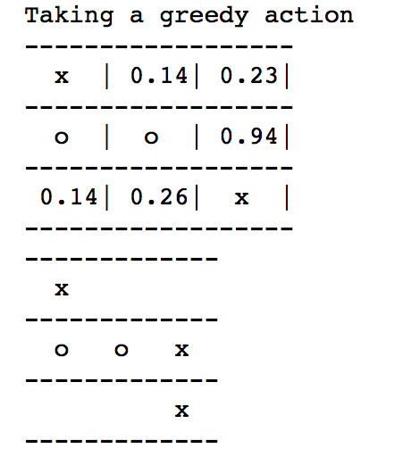

# Reinforcement-learning-Tic_Tac_Toe

### Introduction
<span style="font-family:Papyrus"> Tic-tac-toe was a classic game I use to play back in my adolescent years. During that time, my friends and I would find ourselves quite unengaged often and so we clung to games like Tic-Tac-Toe to alleviate our boredom. We all claimed to have the dominate strategy to win. However, we soon figured out that once both players were privy to the game, the only player to guarantee a win or tie was the starting player. This advantage only ended in a win if the other player was unable to look-ahead and see the most advantagous moves. However, being the second player only guarantees a tie or loss, unless the other player makes a really bad move. After many iterations of playing, most reasonable players only ended in a tie.
</span>

### Is There a Dominate Strategy?
<span style="font-family:Papyrus"> In this project I explored dynamic progamming in the game of Tic-Tac-Toe. My hypothesis of this experiment was to see if I could get the agent (algorithm that calculates the value function based off epsilon and alpha) to converge on my technique to play the game. Below you see the theory behind my strategy. But first lets discuss my strategy. After doing research and recollecting back to my former years, I concluded starting in the corner was the most advantagous. However, you soon will find out that no strategy is dominate unless you reward the agent for acheiving it in fewer steps or find some other unusual way to cohoerce it through rewards. In this particular code there is nothing rewarding it for finding it faster. Also, there is nothing in the code to reward ties to be greater than losses. This could change the results. In the case of starting in the corner, I assumed this was the most dominate strategy becasue probabilistically there are far more permutations that lead to the quickest wins using a "trap" method. This assumption was good with respect to psychology of playing another person since that other person may not be able to look-ahead and see all possible outcomes earlier in the game. Alternatively, it is just as easy for a computer to look-ahead early as it is later on in the game as long as the enviroment isn't too large (in our case it is quite small). Thus, there is no advantage to winning earlier on. Bescause of this, the agent doesn't care if it randomly finds a winning starting move in the corner, in the middle or seldomly on the side. One interesting finding is that it seldomly started in the corner. This is most likely due to being less states (permutations) of winning moves starting in the corner. My below logic explains this a little.  
</span>
<p align="center">
  <h3>Tic-Tac-Toe Theory And Probability </>
  
</p>

### A Brief Theory
<span style="font-family:Papyrus"> In the above diagram, you can see the grid is symmetric in nature, so it is ok to generalize equivilant states to be valued the same in a perfect world. As you will see shortly, this is not the case for this agent or at least it was not what I observed from my many experiments. The next thing to observe is that in the corner case there are 4 out of 5 (one not being showed: the center defensive move) that lead to a win right away if taken advantage of. There are only 1 out of 2 generalized ways to get to a win in equal number of turns from starting in the middle. However, the middle has many ways further in the future to achieve a win. This is true for the corner start as well but far less of those exist. 
</span>

### Lets See The Agent Play My Stategy


```python
if __name__ == '__main__':
  # train the agent
  p1 = Agent(eps = .1, alpha = .1)
  p2 = Agent(eps = .25, alpha = .1)

```

<p align="center">
  <h3>My Strategy Played by the Agent </>
  
  
  
</p>

## Conclusion

<span style="font-family:Papyrus"> As stated above, my original hypothesis did not hold true for this problem. Regardless, the agent learned a optimal policy simply based off random actions given certain epsilon values combined with alpha values (its learning rate). Additionally, I learned that you can train the agents with different epsilons and alpha values. This proved to be interesting and made it more likely for me to train the agent in my stategy. Although, it did not always choose the corner as a starting point due to randomnes of exploration. For future research, it would be interesting to investigate rewarding ties with higher values than losses and find a way to include a discount factor for more moves till completing a win. Of course this is assuming the advantage is your opposing player is not very good at seeing further into the future. 
</span>
